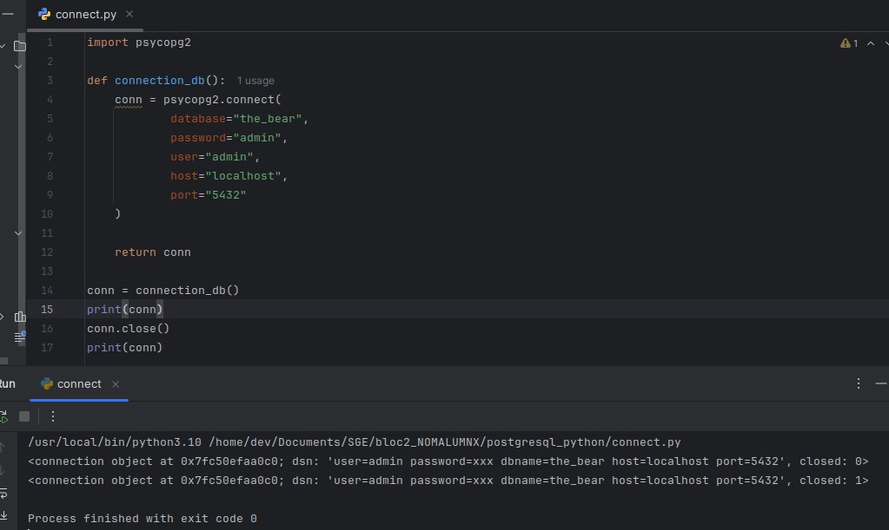
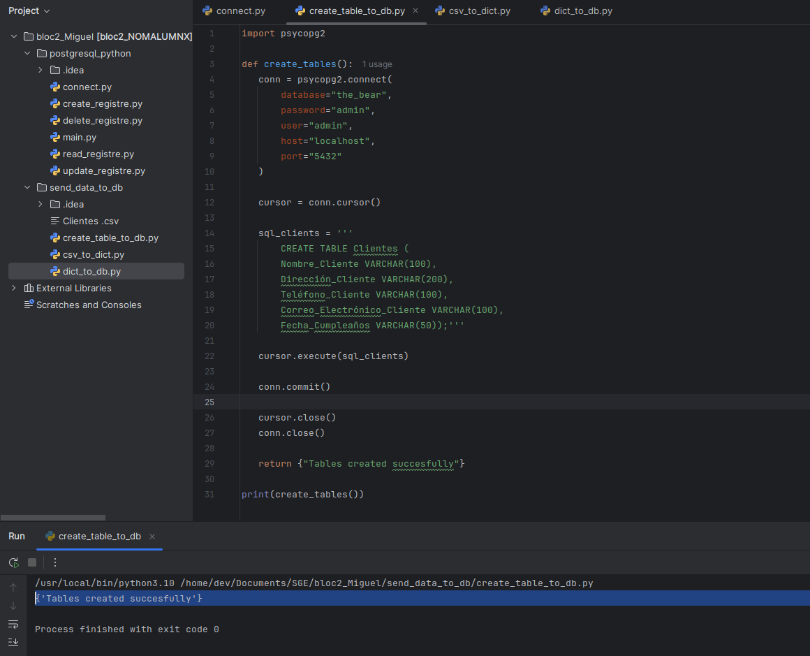
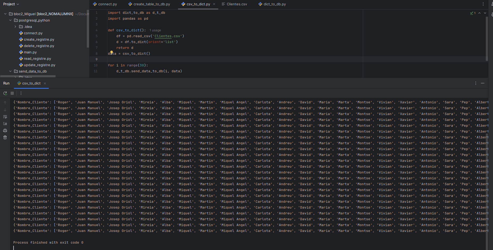
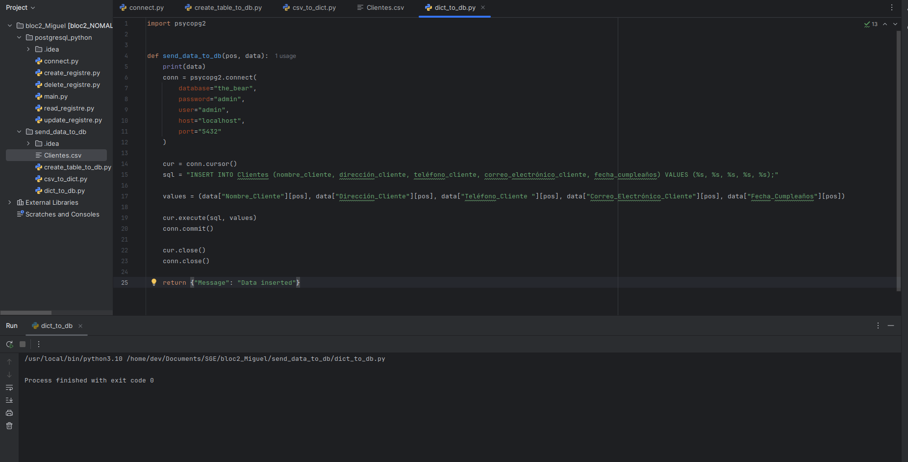
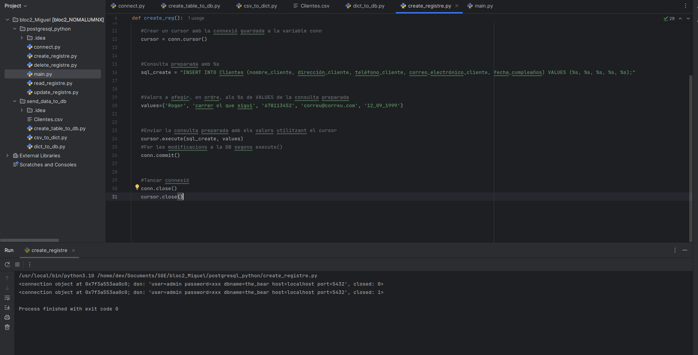
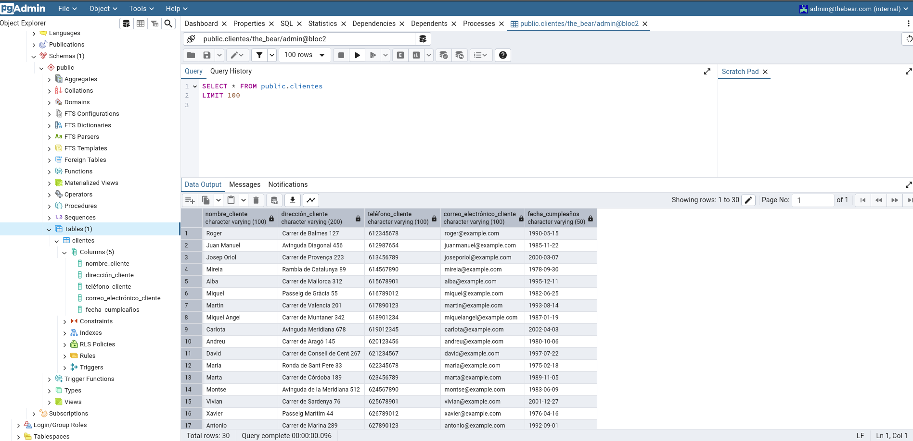
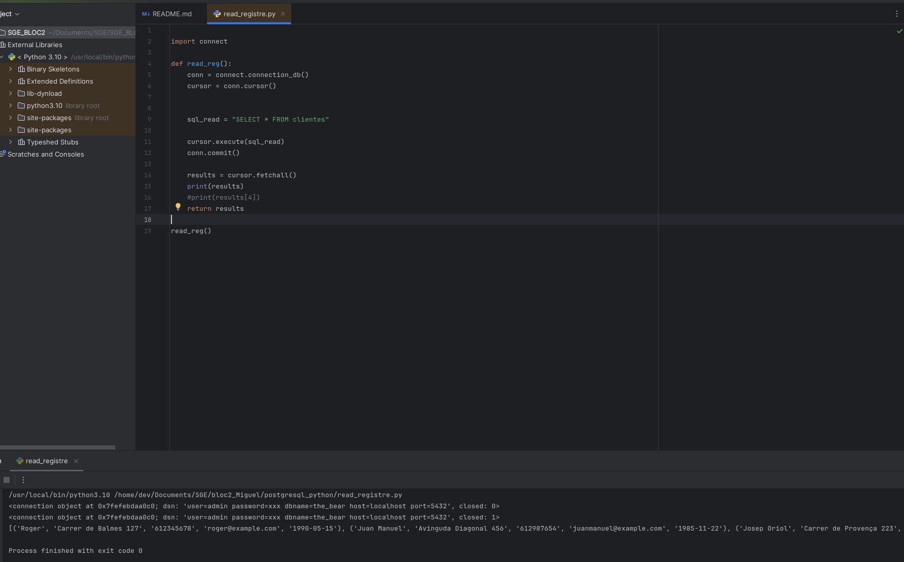
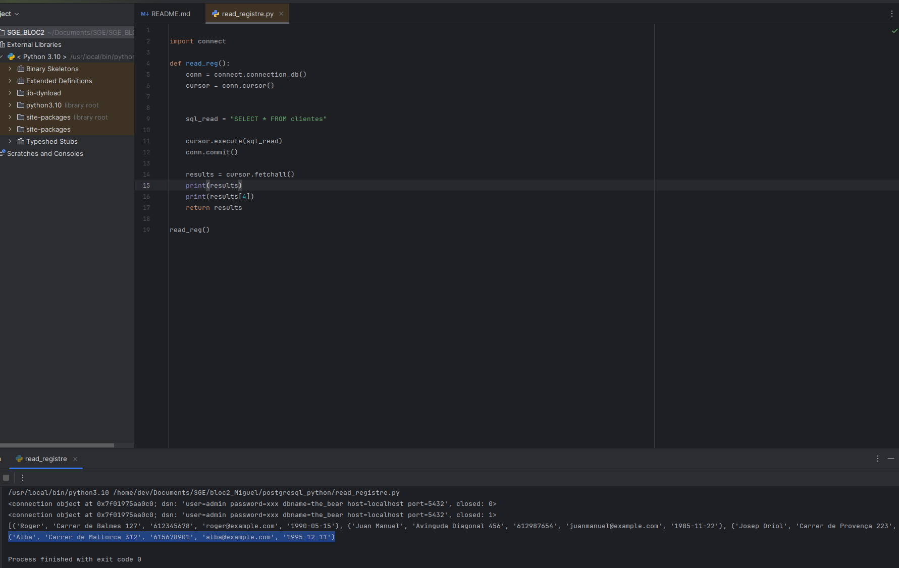
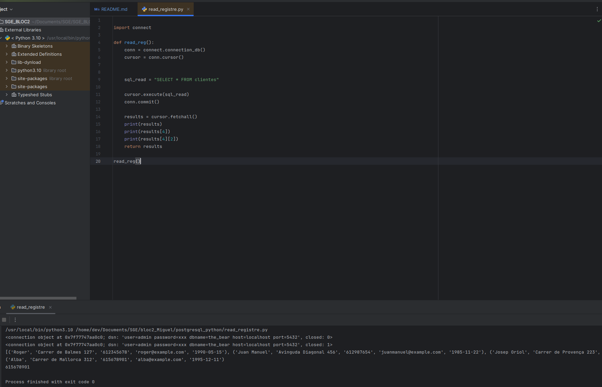

# SGE_BLOC2

### **CONNEXIÓ A BASE DE DADES**

S'està realitzant una connexió a una base de dades PostgreSQL a través d'una llibreria psycopg2. A dins del codi es pot veure com a través de la funció connection_db() s'estableix una connexió amb la base de dades the_bear utilitzant els paràmetres proporcionats. Es retorna l'objecte conn que representa la connexió a PostgreSQL. El print(conn) mostra com la connexió s'ha establert correctament (closed: 0) i com es tanca satisfàctoriament (closed: 1).

Per arribar fins aqui abans he tingut que posar en marxa PostgreSQL a traves de Docker, crear l'entorn virtual on funcioni Python 3.10, instal·lar les llibreries de  psycopg2 per connectar-se a PostgreSQL i poder carregar l'arxiu .csv amb el que treballarem i pandas per gestionar dades d'aquesta base de dades (com llegi, editar, etc.).

### **INSERCIÓ DEL REGISTRE A LA BASE DE DADES**

Després de descarregar les dades en format csv, passem a la part del procés per inserir aquestes dades 
a la nostra base de dades.

Com veiem a la imatge, al primer pas utilitzem l'arxiu **create table** per crear una taula 
sense cap registre encara i tot seguint el format de l'arxiu csv esmentat anteriorment. Més específicament, veiem 
com en aquest arxiu es defineix una funció amb nom _create_table_ que estableix una connexió amb la base de dades 
de PostgresSQL tot executant una consulta SQL per crear uan taula anomenada "clientes".

Després es guarden els canvis i es tanca la connexió i el **cursor**. Aquest últim, aclarir, que és 
un objecte en psycopg2 que permet executar consultes SQL dins d'una connexió (conn). És la forma d'interactuar
amb la base de dades des de Python. En la imatge es pot veure com estableix la connexió (cursor = conn.cursor())
i executa la creació de la taula (cursor.execute(sql_clients)) 

Amb l'arxiu csv to dict transformem la informació del csv en format **diccionari**, és a dir,
en un tipus de dada on Python emmagatzema informació en parelles clau-valor. Això permet
organitzar i accedir fàcilment a les dades.

Després envia les dades a la base de dades amb d_t_bdb-send_data_to_db.

L'últim pas de la inserció de les dades a la base de dades implica insertar les dades 
del diccionari a la base de dades columna per columna, és a dir, inserir els valors de les diferents
columnes existents a la base de dades, nom, adreça, telèfon, etc.

Després de fer-ho i guardar-ho i tancar la connexió es rep un missatge de 
confirmació _"Process finished with exit code 0"_

### CREAR REGISTRES

Aquí veiem com amb el codi de l'arxiu create registre podem crear una entrada nova a la base de dades. 
Així amb cursor=conn.cursor() establim la connexió, després li passem el format de la consulta (sql_create) 
i els valors a adherir (values) i per últim ho executem amb cursor.execute(sql_create, values)

Al final veiem el coe 0 qie significa que el registre s'ha efectuat correctament, es a dir, s'ha fet la connexió,
s'ha traspassat a la informació de les dades del registre i s'ha tancat la connexió amb la base de dades

Aquí veiem el resultat a la base de dades, on en la primera fila comprovem que amb el nom Roger, s'han introduït
totes les dades de la resta de columnes correctament.

Per realitzar aquesta inserció a la taula cal també fer canvis a l'arxiu main perquè cridi a executar la
funció cr.create_reg(). El codi fa una trucada a create_reg dins del codi de l'arxiu create_registre.py, comentat 
anteriorment.

### MÈTODES PER EXTREURE INFORMACIÓ

A la imatge veiem com primer s'estableix una connexió amb la base de dades mitjançant
_conn_ i després s'inicialitza _cursor_ per poder executar consultes SQL. Es dona l'ordre de 
_sql_read_ (llegir) totes (*) les dades de la taula "clientes". La part que més ens interessa 
és la següent, amb cursor.fetchall() (a diferència de _fetchone_ q només recupera una fila)
es recuperen totes les files retornades per la consulta i amb print es mostren els resultats
per pantalla.

Ara veiem com hem fet una consulta específica a l'índex 4, que correspon al id_cliente 5 (Alba).
A considerar que és índex 4 perquè comença a comptar des de 0.

Ara es mostra la informació del telèfon de Alba que correspon a la fila de la base de dades índex 4
i dins d'aquesta fila a la columna 2, on estan guardats els telèfons. És un Array d'un array.